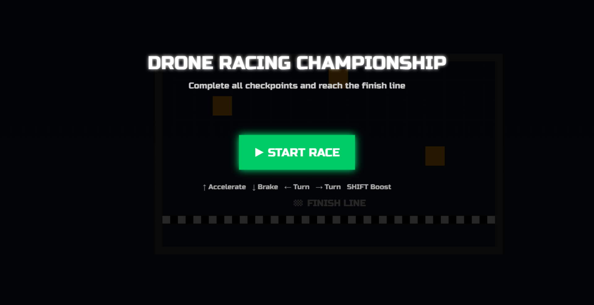
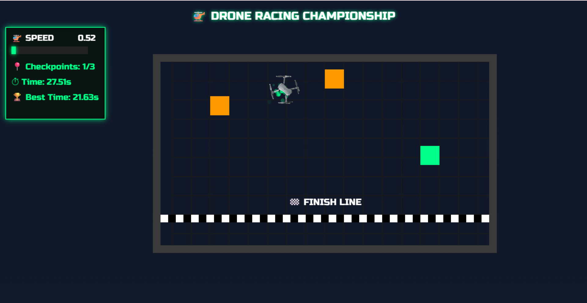
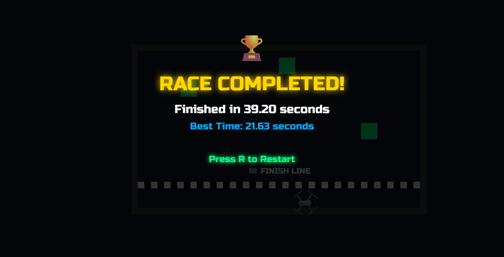

# 🚁 Drone Racing Championship

<p align="center">
  
</p>

<p align="center">
  A modern browser-based drone racing game built using HTML5 Canvas, JavaScript, and CSS.
</p>

---

## 🎮 About The Project

Drone Racing Championship is a fast-paced racing game where players navigate a drone through checkpoints and race against time to achieve the best score.

The project was built to explore:

- HTML5 Canvas Rendering
- Game Development Fundamentals
- Collision Detection
- Local Storage
- Audio Integration
- Particle Effects
- Modern UI/UX Design

---

## ✨ Features

✅ Smooth Drone Controls

✅ Speed Boost System

✅ Checkpoint Tracking

✅ Collision Detection

✅ Full Width Racing Finish Line

✅ Best Time Record System

✅ Local Storage Support

✅ Particle Effects

✅ Drone Engine Sound

✅ Modern Gaming HUD

✅ Responsive Full-Screen Canvas

✅ Professional Racing Arena Design

---

## 🕹 Controls

| Key | Action |
|------|---------|
| ↑ | Accelerate |
| ↓ | Brake |
| ← | Turn Left |
| → | Turn Right |
| Shift | Speed Boost |
| R | Restart Race |

---

# 📸 Screenshots

## 🚀 Start Screen

<p align="center">
  
</p>

---

## 🎮 Gameplay

<p align="center">
  
</p>

---

## 🏆 Race Complete

<p align="center">
  
</p>

---

## 🏗 Project Structure

```text
Drone-Racing-Championship
│
├── assets
│   ├── images
│   │   └── drone.png
│   │
│   └── sounds
│       └── drone-engine.mp3
│
├── css
│   └── style.css
│
├── js
│   ├── drone.js
│   ├── track.js
│   ├── collision.js
│   ├── particles.js
│   └── game.js
│
├── screenshots
│   ├── start-screen.png
│   ├── gameplay.png
│   └── race-complete.png
│
├── index.html
└── README.md
```

---

## 🛠 Technologies Used

- HTML5
- CSS3
- JavaScript (ES6)
- HTML5 Canvas API
- Local Storage API

---

## 🚀 How To Run

1. Clone the repository

```bash
git clone https://github.com/mahathiii3/Drone-Racing-Championship.git
```

2. Open the project folder

3. Launch using VS Code Live Server

4. Enjoy the race 🚁

---

## 👩‍💻 Author

### Mahathi Vaka

GitHub:
https://github.com/mahathiii3

---

⭐ If you like this project, consider giving it a star.
